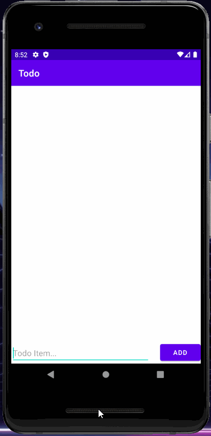
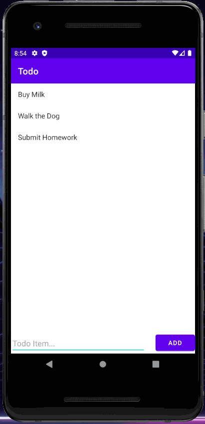

# Android Todo Application

## Objective
* Create a simple Android application to record user todo items.

## Features

### Add Item
* User inputs an item into the empty field and clicks on 'Add' to added it to their todo list.

### Remove Item
* User long presses any item on the displayed list to delete Item.

### Edit Item
* User clicks on item to switch to the edit screen. Once there, the user can modify thier todo item and press save to update the
item on the list.

### Persistence
* After adding/modifing/deleting items in the todo list, the user can terminate the application. Once the application is started again
the same items will be displayed in their appropriate order. 

